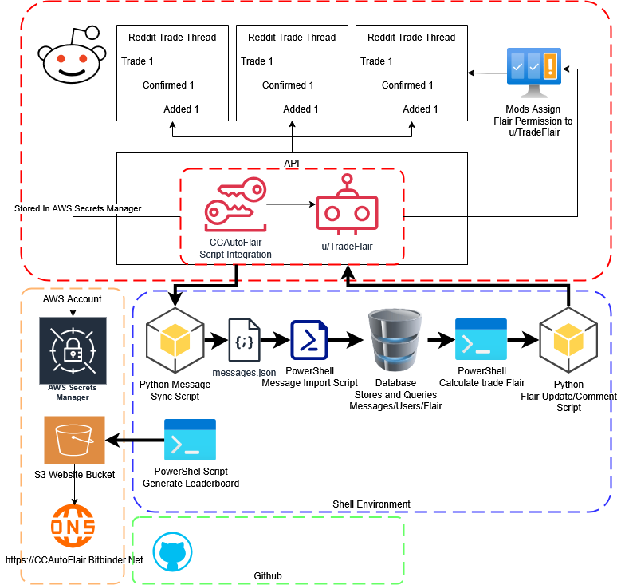

[Visit the Leaderboard!](https://tradeflair.bitbinder.net)




## Linux Setup

0. Install and Configure Prereqs

```bash
# Install Powershell
# Update packages
sudo apt-get update

# Install dependencies
sudo apt-get install -y wget apt-transport-https software-properties-common

# Download Microsoft repository GPG keys
wget -q https://packages.microsoft.com/config/ubuntu/22.04/packages-microsoft-prod.deb

# Register the repository
sudo dpkg -i packages-microsoft-prod.deb

# Update again and install PowerShell
sudo apt-get update
sudo apt-get install -y powershell
```

```bash
# Install AWS Cli
sudo apt-get update
sudo apt-get install awscli -y
```

1. Download and configure

```bash
git clone https://github.com/bitbindernet/TradeFlair.git
cd TradeFlair
sudo apt update
sudo apt install python3-pip -y
sudo apt install python3.12-venv
python3 -m venv venv
source venv/bin/activate
pip install praw

```
